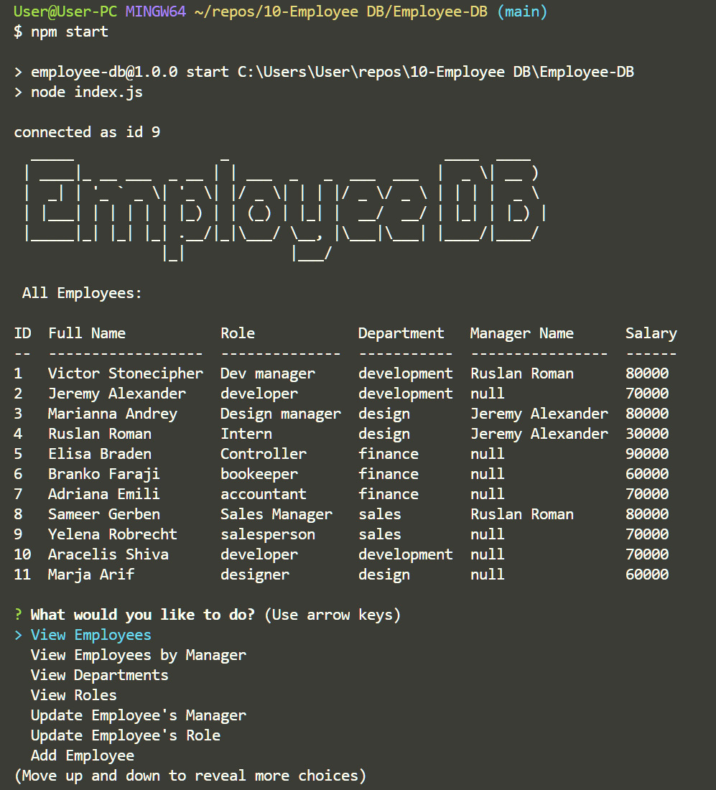

# Employee DB <!-- omit in toc -->
--- 
### Table of Contents

- [Live Site](#live-site)
- [Description](#description)
- [Installation](#installation)
- [How to use it](#how-to-use-it)
- [Future Development](#future-development)
  - [Credits](#credits)
  - [How to contribute](#how-to-contribute)
  - [Tests](#tests)
  - [License](#license)
  - [Questions](#questions)

## Live Site
[View Now]()

## Description
Human Resources Employee Database Command Line Interface. Seperate Employees, Roles and Departments.

___Technologies Used___
- Node
- Inquirer
- mySQL

___Motivation___
Move away from spreadsheets.

## Installation
1) Download the zip of this repository.
2)  Unzip it to a location of your choice.
3)   Navigate to the DB folder and open the Schema.sql and Seed.sql files in SQL Workbench.
4) Run Schema.sql, and then seed.sql in SQL Workbench in that order.
5) Once the database is running, open a terminal in the Employee-DB folder and run "npm i" to install dependencies.
6) In the Employee-DB folder, create a file called .env and write in it "SQL_PASSWORD=" followed by your database password.
7)  You're done!

## How to use it
1) Open a terminal in the "Employee-DB" folder and type "npm start" to envoke the program.

## Future Development
1) A way to exit every menu of the program to the main menu.
2) Add Validation to all the entry fields.
3) More error handling.

### Credits
Developers: C.T. Bell
### How to contribute
This is a closed project

### Tests
No tests provided

### License
#####MIT
[Link to MIT licence](https://opensource.org/licenses/MIT)

### Questions
If you have a question about this software, contact the developer at:
charlestbell@gmail.com

Welcome Page
